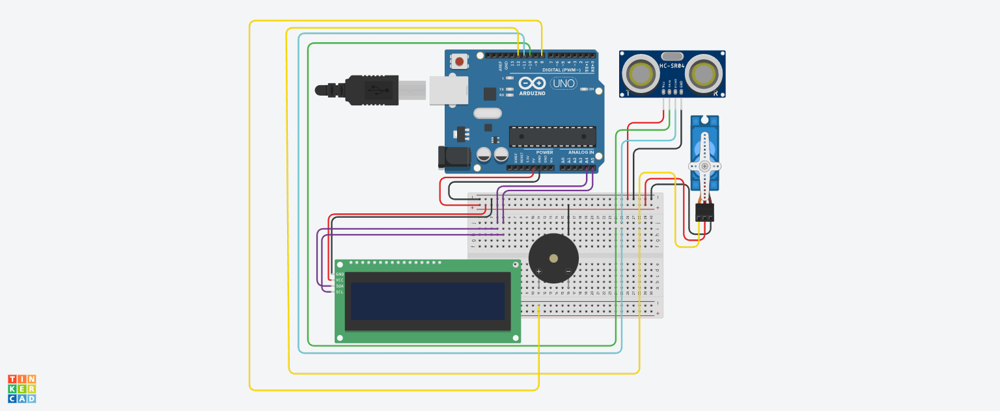
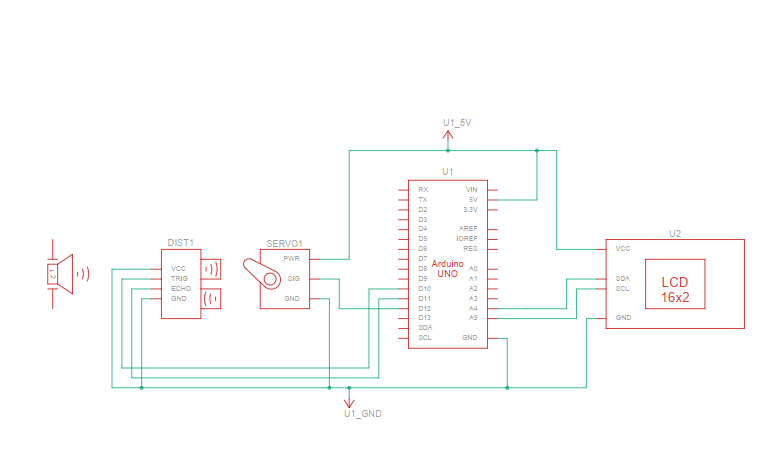

# Arduino Radar Mini Project

## 📡 Overview

This mini project implements a **radar-like system** using **Arduino**, **ultrasonic sensor (HC-SR04)**, and a **servo motor** to scan objects in front of it.  
The detected distance and angle are sent via **Serial communication** to **Processing** for real-time radar visualization.

The system also includes:

- **I2C LCD 1602** to display obstacle status and distance
- **Buzzer** that sounds only when an obstacle is detected

---

## 🧩 Features

- Servo sweeps from **0° to 180°** to simulate radar scanning
- Detects obstacles within a **40 cm radius**
- Real-time data output in Processing-compatible format
- LCD displays:
  - Obstacle detected / No obstacle
  - Distance to the obstacle (cm)
- Buzzer alerts **only when an obstacle is detected**
- Stable power design with **common ground**

---

## 🛠️ Hardware Components

- Arduino Uno / Nano
- HC-SR04 Ultrasonic Sensor
- SG90 (or similar) Servo Motor
- LCD 1602 with I2C module
- Buzzer (active or passive)
- Breadboard & jumper wires

---

## 🔌 Wiring Summary

| Component       | Arduino Pin |
| --------------- | ----------- |
| Servo Signal    | D12         |
| Ultrasonic TRIG | D10         |
| Ultrasonic ECHO | D11         |
| Buzzer          | D8          |
| LCD SDA         | A4          |
| LCD SCL         | A5          |
| LCD VCC         | 5V          |
| LCD GND         | GND         |

---

## 💡 Software & Libraries

### Arduino Libraries

- `Servo.h`
- `Wire.h`
- `LiquidCrystal_I2C.h`

### Processing

- Used to draw the radar visualization based on Serial data.

## Note:

- You can decrease the buzzer's volume by adding a resistor! (It's too loud for me :D)
